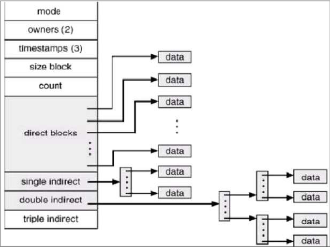
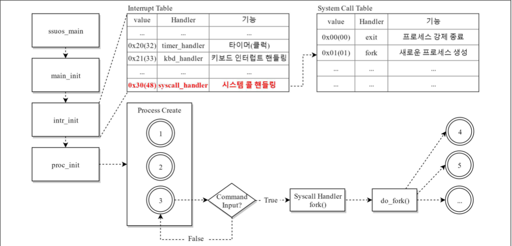

# OS_SYSTEM_CALL

[CAUTION]

If you want to execute this source code on your computer, you have to run this software on 32bit Ubuntu Linux 16.04.
In addition, I'm not a native English speaker,so please consider it when you read this script. :)

[COPYRIGHT]

All copyright is belong to Soongsil University OS Lab and this project was third subject of OS class.

[OVERVIEW]

The main objects of this project had three parts. First of all, we should understand what the system call is through this 
project. Second, we have to append more functions in the system call 'open()' given by OS LAB. Last of all, we have to make 
'fcntl()' which is one of the system calls and had to append several functions.

The basic informations we should know to make this project are like below.

1. 'inode' : It is the object to manage file. If the file is created, the new inode will be also created.

The inode contains informations of file.

  1. The position of block which is included file.
  
  2. The owner of file and permission of file.
  
  3. The time information of file.
  
  4. The type of file. (not only regular file, but also directory, device, pipe, and socket)
  
  5. It exists as static in disk.
  
2. The routine of system call

The above image describes how the system handles 'fork()'.

  1. Enroll 'syscall_handler()' in IDT(Interrupt Desciptor Table) to handle system call in 'intr_init()'.
  
  2. Define the system call table to handle each system call.
  
  3. The process which was created by 'fork()' calls 'login_proc()' which is login function.
  
  4. After calling 'shell_proc()', the OS calls 'system calls' when user commands are inputted
     
  5. Run 'syscall_handler()' which handles system call.
  
  6. Create the child process by calling 'do_fork()' which executes the real 'fork()' job.
  
[OBJECT]

1. Write the system call code about 'open()'

2. Write the system call code about 'fcntl()'

The above objects were my project goals.
